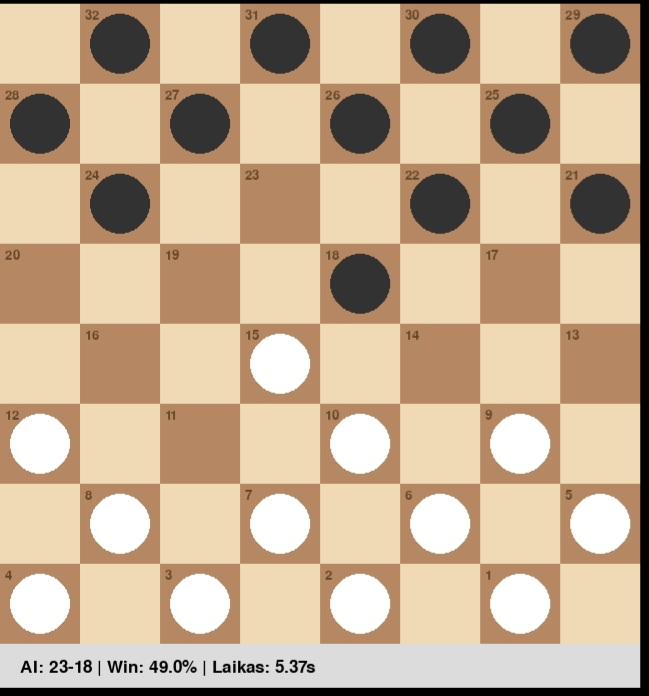
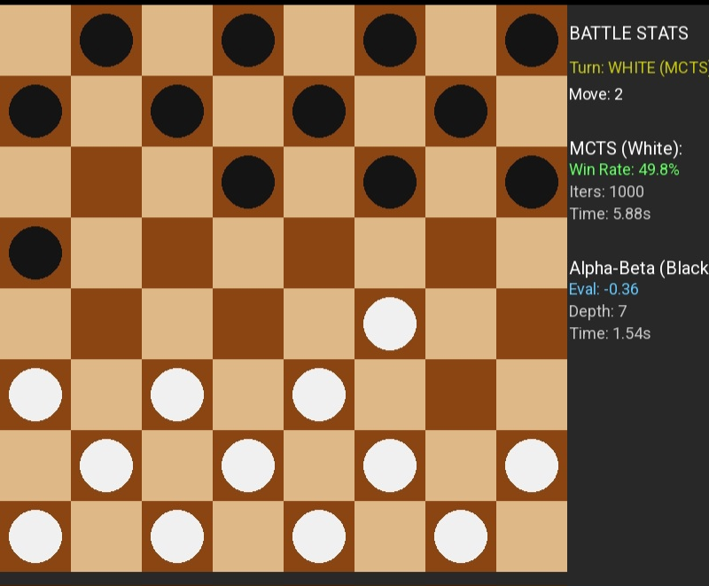
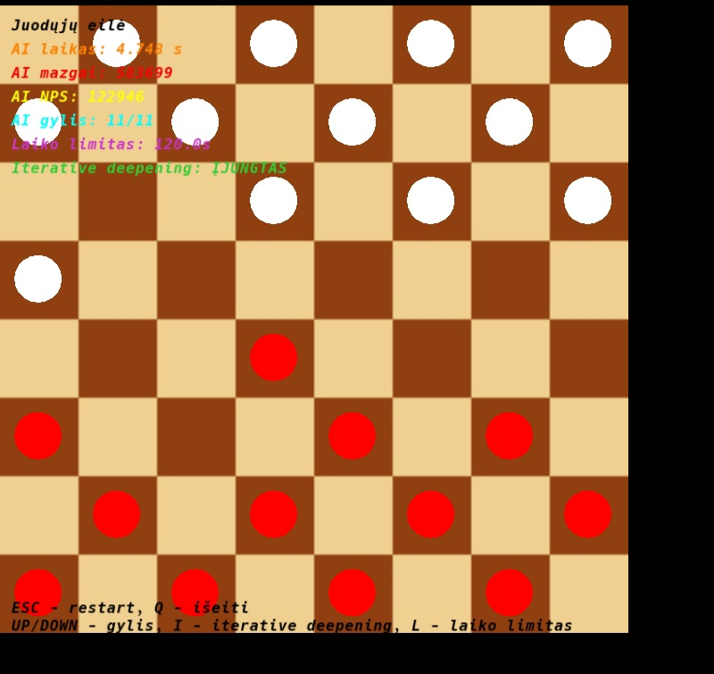
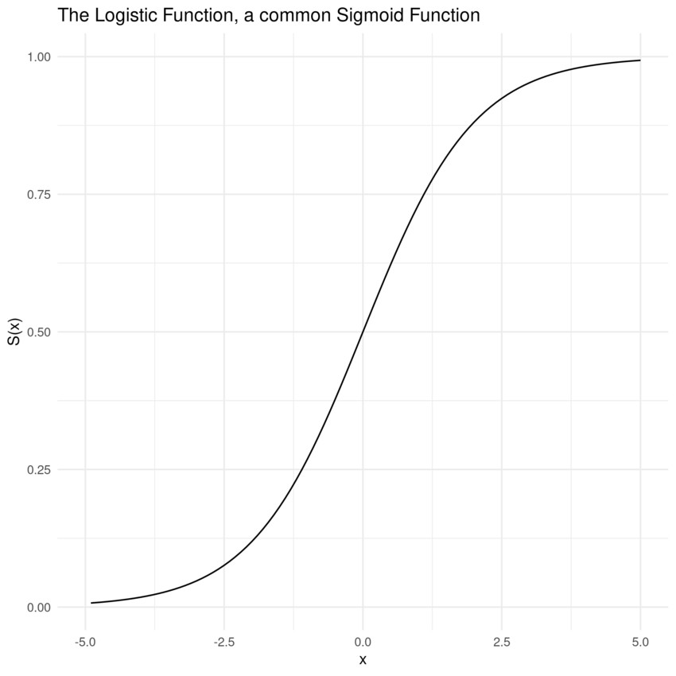
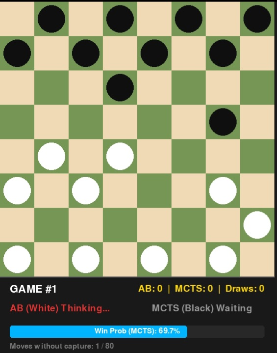

There are files
1. bison8_fractional.py
2. bison_battle.py
3. Checkers_in_Lua.love
4. assistant.py

1.Use this to play against mcts,nice pygame interface,default 
iterations are set to 1000,
i.e. computer "thinks" 1000 times.

2.Designed to watch mcts vs alpha-beta battle, there are adjustable
parameters
ab - depth and mcts - iterations.
Current depth 7 and iterations 1000.

3.Checkers game written in Lua language.To view Checkers_in_Lua.
love contents rename it to Checkers_in_Lua.zip and open with any archive viewer. In order to launch this game you should go to 

https://love2d.org/

and download Lua installer.
If you extract Checkers_in_Lua.zip to some folder then you will have all source code in one place . 
Steps:
We have *.love file -> rename it to *.zip
Extract this zip file to chosen folder
Now you can see and edit these source code files freely
After editing compress these files to zip ( archive )
Now rename this archive ( with extension zip ) to extension love
ie Checkers_in_Lua.zip rename to Checkers_in_Lua.love
Now Checkers_in_Lua.love will be new version of the game.

In fact files with extension love are Lua executables.
These *.love files are archives ( zipped with zip , and renamed to *.love ).
In order to work with Lua ,zip archive utility is necessary.
We have zip and to unzip files , rename them. 

Apparently Lua has fastest in the world interpreter , but so far language is used for hobby projects mainly.

*.love -> rename to *.zip -> extract -> edit source -> compress to 
*.zip -> rename to *.love ( this will be edited executable ).

----------------------------------------
About mcts search logic.

In code this function is used there:

k = 0.4 # adjustable parameter k, sensitiveness to material imbalance

prob_white = 1 / (1 + math.exp(-k * score)) # Sigmoid

here score is evaluation of checkers position.

if man is worth 1 , king is worth 2 , then position's evaluation is
in interval let's say (-5,5) or in (-10,10).

Sigmoid takes this score as argument and clamps ( squashes ) score into interval (0,1). Final position's score will be fraction between 0 and 1. 

Having score in interval (0,1) it is easier to work with backpropagate and best_child functions. Because if one color has score , then other's ( opponent's ) score will be (1 - score).

This fact in backpropagate and in best_child plays crucial role.

-----------------------------------------------------------------
4. Battle AB versus MCTS ( assistant.py )

 

   
